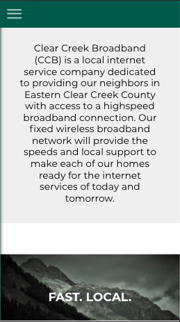
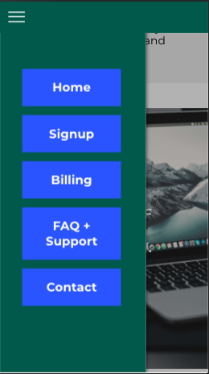
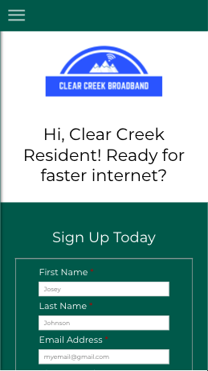

<h1>CCB React Client<h1>

* Live Website: https://ccb-app.now.sh/

## Description

Clear Creek Broadband (CCB) is a local internet service company dedicated to providing their neighbors in Eastern Clear Creek County (outside of Denver, CO) with access to a highspeed broadband connection. The purpose of this application is to be informative and to provide an easy channel for users to request service, join the mailing list to stay informed, and/or volunteer to help CCB with projects.

## Screenshots

Landing Page Description:

Mobile Navigation:

Signup Form:

## Technology

* React
* JavaScript
* HTML5
* CSS3
* Testing: Jest

